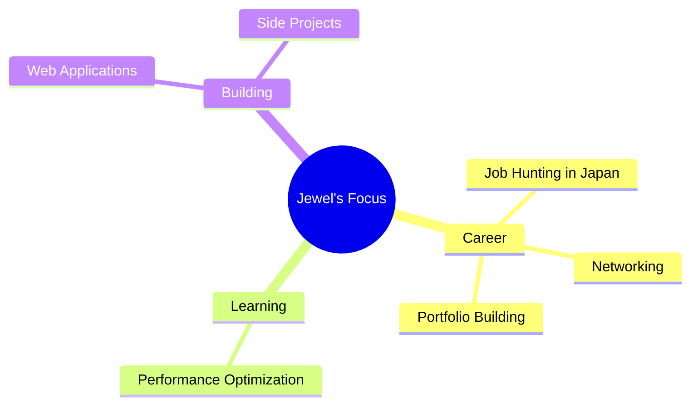

<div align="center">


<h3>
  
</h3>

[](https://portfolio-frontend-five-blond.vercel.app)
[](https://linkedin.com/in/sahajewelkumar)
[](mailto:jewelsaha072@gmail.com)
[](https://x.com/sahaJewelkumar)


</div>

<br/>


### 🚀 About Me

```typescript
const jewel = {
  location: "🗼 Tokyo, Japan",
  role: "💻 Full Stack Developer",
  languages: {
    spoken: ["🇬🇧 English", "🇯🇵 Japanese", "🇧🇩 Bengali"],
    programming: ["TypeScript", "JavaScript", "SQL"]
  },
  currentFocus: [
    "Seeking Full Stack opportunities in Japan",
    "Building scalable web applications",
    "Exploring AI/ML integration"
  ],
  funFact: "I design software like structures - strong foundations first! 🏛️"
};
```

<br/>
<br/>

---

### 🎯 What I'm Up To



<div align="center">

### 💼 Open to Opportunities • 🤝 Available for Freelance • 🌟 Let's Collaborate

</div>

---

### 🛠️ Tech Stack

<div align="center">

<table>
<tr>
<td valign="top" width="33%">

#### Frontend
<div align="center">  

</div>

</td>
<td valign="top" width="33%">

#### Backend
<div align="center">  

</div>

</td>
<td valign="top" width="33%">

#### Tools
<div align="center">  

</div>

</td>
</tr>
</table>

</div>

---

### 📊 GitHub Analytics

<div align="center">
  
  
</div>

<div align="center">
  
</div>

<div align="center">
  
</div>

---

### 🏆 Achievements

<div align="center">
  
</div>

---

### 💡 What I Build

<div align="center">

<table>
<tr>
<td align="center" width="25%">

<br/><b>Web Apps</b>
<br/><sub>Full-stack applications with modern frameworks</sub>
</td>
<td align="center" width="25%">

<br/><b>UI/UX</b>
<br/><sub>Beautiful, responsive interfaces</sub>
</td>
<td align="center" width="25%">

<br/><b>APIs</b>
<br/><sub>RESTful backend services</sub>
</td>
<td align="center" width="25%">

<br/><b>Databases</b>
<br/><sub>Efficient data modeling</sub>
</td>
</tr>
</table>

</div>

---

### 📈 Contribution Activity

<div align="center">
  
</div>

---

### 🎯 Featured Projects

<div align="center">

<a href="https://github.com/Sahajewel?tab=repositories">
  
</a>

<br/><br/>

> 💡 Pin your best repositories below to showcase them here!

</div>

---

### 📫 Let's Connect

<div align="center">


<br/>

### 🌏 Based in Tokyo, Japan

<br/>

<table>
<tr>
<td align="center" width="33%">

<br/><b>Email</b>
<br/><a href="mailto:jewelsaha072@gmail.com">jewelsaha072@gmail.com</a>
</td>
<td align="center" width="33%">

<br/><b>LinkedIn</b>
<br/><a href="https://linkedin.com/in/sahajewelkumar">@sahajewelkumar</a>
</td>
<td align="center" width="33%">

<br/><b>Phone</b>
<br/>+81 80 5052 6822
</td>
</tr>
</table>

<br/>

### 💼 Open for Opportunities | 🤝 Available for Freelance | 🌟 Let's Collaborate!

<br/>

```
💡 "Engineering precision meets creative innovation"
🏗️ From building bridges to building applications
🚀 Turning complex problems into elegant solutions
```

<br/>

### ⭐ If you like my work, drop a star on my repos!

[](https://github.com/Sahajewel)

</div>

---

<div align="center">

### 🙏 Thanks for stopping by!

&nbsp;
&nbsp;


</div>


