<div align="center">

<!-- Modern Animated Header - Fully Responsive -->
<picture>
  <source media="(max-width: 600px)" srcset="https://capsule-render.vercel.app/api?type=waving&color=gradient&customColorList=0,2,2,5,30&height=150&section=header&text=Saha%20Jewel&fontSize=40&fontColor=fff&animation=fadeIn&fontAlignY=35"/>
  <source media="(max-width: 900px)" srcset="https://capsule-render.vercel.app/api?type=waving&color=gradient&customColorList=0,2,2,5,30&height=180&section=header&text=Saha%20Jewel%20Kumar&fontSize=50&fontColor=fff&animation=fadeIn&fontAlignY=38&desc=Full%20Stack%20Developer&descAlignY=55&descSize=16"/>
  
</picture>

<!-- Dynamic Typing Effect - Mobile Optimized -->
<div style="margin: 20px 0;">
  <picture>
    <source media="(max-width: 600px)" srcset="https://readme-typing-svg.demolab.com?font=JetBrains+Mono&size=16&duration=3000&pause=800&color=667EEA&center=true&vCenter=true&multiline=true&repeat=true&width=400&height=100&lines=%F0%9F%9A%80+Building+Solutions;%F0%9F%8C%8F+BD+%F0%9F%87%A7%F0%9F%87%A9+%E2%86%92+JP+%F0%9F%87%AF%F0%9F%87%B5;%F0%9F%92%BB+Full+Stack+Dev"/>
    <source media="(max-width: 900px)" srcset="https://readme-typing-svg.demolab.com?font=JetBrains+Mono&size=20&duration=3000&pause=800&color=667EEA&center=true&vCenter=true&multiline=true&repeat=true&width=600&height=110&lines=%F0%9F%9A%80+Building+Digital+Solutions;%F0%9F%8C%8F+Bangladesh+%F0%9F%87%A7%F0%9F%87%A9+%E2%86%92+Japan+%F0%9F%87%AF%F0%9F%87%B5;%F0%9F%92%BB+React+%E2%80%A2+Next.js+%E2%80%A2+TypeScript"/>
    
  </picture>
</div>

<!-- Social Badges - Stack on Mobile -->
<p align="center">
  <a href="https://portfolio-frontend-five-blond.vercel.app" target="_blank">
    
  </a>
  <a href="https://linkedin.com/in/sahajewelkumar" target="_blank">
    
  </a>
  <a href="mailto:jewelsaha072@gmail.com">
    
  </a>
  <a href="https://x.com/sahaJewelkumar" target="_blank">
    
  </a>
</p>

<!-- Status Badges - Responsive -->
<p align="center">
  
  
  
</p>

</div>

<br/>

---

<!-- About Me Section - Responsive Grid -->
<div align="center">

## 🎯 About Me

</div>

<!-- Mobile: Stack Vertically, Desktop: Side by Side -->
<table width="100%">
<tr>
<td width="100%" colspan="2">

### 👨‍💻 Professional Profile

```typescript
const jewel = {
  location: "🗼 Tokyo, Japan",
  role: "💻 Full Stack Developer",
  experience: "Web Development",
  passion: "Building Scalable Solutions",
  
  languages: {
    spoken: ["English 🇬🇧", "Japanese 🇯🇵", "Bengali 🇧🇩"],
    programming: ["TypeScript", "JavaScript", "SQL"]
  },
  
  currentStatus: {
    seeking: "Full Stack Opportunities in Japan",
    learning: "AI/ML Integration",
    working: "Scalable Web Applications"
  }
};
```

</td>
</tr>
<tr>
<td width="50%" align="center">


</td>
<td width="50%">

### 🌟 Quick Facts

- 🔭 Building modern web applications
- 🌱 Exploring **AI/ML** integration
- 👯 Open to collaborate on projects
- 💼 Available for **freelance** work
- 🎯 Goal: Full-stack role in Japan
- ⚡ Fun: Design software like structures!

</td>
</tr>
</table>

<br/>

---

<!-- Tech Stack - Responsive Layout -->
<div align="center">

## 🛠️ Tech Arsenal

<!-- Frontend -->
### 🎨 Frontend


**Next.js • React • Redux • TypeScript • JavaScript • TailwindCSS**

<br/>

<!-- Backend -->
### ⚙️ Backend


**Node.js • Express.js • PostgreSQL • MongoDB • Prisma • Firebase**

<br/>

<!-- Tools -->
### 🚀 Tools & DevOps


**Git • GitHub • VS Code • Postman • Vercel • Docker**

</div>

<br/>

---

<!-- GitHub Stats - Responsive -->
<div align="center">

## 📊 GitHub Analytics

<details open>
<summary><b>📈 Contribution Stats</b></summary>
<br/>

<!-- Mobile: Stack Vertically -->
<picture>
  <source media="(max-width: 768px)" srcset="https://github-readme-stats-sigma-five.vercel.app/api?username=Sahajewel&show_icons=true&theme=tokyonight&include_all_commits=true&count_private=true&hide_border=true&border_radius=15&bg_color=0D1117&title_color=667EEA&icon_color=667EEA&text_color=FFFFFF"/>
  
</picture>

<br/>

<picture>
  <source media="(max-width: 768px)" srcset="https://github-readme-stats-sigma-five.vercel.app/api/top-langs/?username=Sahajewel&layout=compact&langs_count=6&theme=tokyonight&hide_border=true&border_radius=15&bg_color=0D1117&title_color=667EEA&text_color=FFFFFF"/>
  
</picture>

</details>


<details open>
<summary><b>📅 Contribution Graph</b></summary>
<br/>


</details>


</div>

<br/>

---

<!-- What I Build - Responsive Grid -->
<div align="center">

## 💡 What I Build

</div>

<table width="100%">
<tr>
<td align="center" width="25%">

<br/><b>Web Apps</b>
<br/><sub>Full-stack solutions</sub>
</td>
<td align="center" width="25%">

<br/><b>UI/UX</b>
<br/><sub>Responsive design</sub>
</td>
<td align="center" width="25%">

<br/><b>APIs</b>
<br/><sub>RESTful services</sub>
</td>
<td align="center" width="25%">

<br/><b>Database</b>
<br/><sub>Data modeling</sub>
</td>
</tr>
</table>

<br/>

---

<!-- Current Focus - Simplified for Mobile -->
<div align="center">

## 🎯 Current Focus

```mermaid
mindmap
  root((Jewel))
    Career 💼
      Job Hunting
      Networking
      Portfolio
    Learning 📚
      AI/ML
      TypeScript
      Design
    Building 🛠️
      Web Apps
      Open Source
      Projects
    Growth 🌱
      Writing
      Community
      Skills
```



</div>

<br/>

---

<!-- Featured Projects - Responsive -->
<div align="center">

## 🎯 Featured Projects

</div>

<table width="100%">
<tr>
<td width="50%">

### 🌟 Highlights
- 📱 Responsive apps
- 🔐 Auth systems
- 📊 Dashboards
- 🚀 Optimized code

</td>
<td width="50%">

### 💼 Services
- 🎨 Frontend Dev
- ⚙️ Backend Dev
- 🌐 Full Stack
- 🔧 API Integration

</td>
</tr>
</table>

<div align="center">

<a href="https://github.com/Sahajewel?tab=repositories">
  
</a>

> 💡 Pin your best repos to showcase them!

</div>

<br/>

---

<!-- Connect Section - Mobile Friendly -->
<div align="center">

## 📫 Let's Connect


### 🌏 Based in Tokyo, Japan

</div>

<table align="center" width="100%">
  <tr>
    <td align="center" width="25%">
      
      <br/><b>Email</b>
      <br/><sub><a href="mailto:jewelsaha072@gmail.com">Contact</a></sub>
    </td>
    <td align="center" width="25%">
      
      <br/><b>Portfolio</b>
      <br/><sub><a href="https://portfolio-frontend-five-blond.vercel.app">Visit</a></sub>
    </td>
    <td align="center" width="25%">
      
      <br/><b>LinkedIn</b>
      <br/><sub><a href="https://linkedin.com/in/sahajewelkumar">Connect</a></sub>
    </td>
   
    <td align="center" width="25%">
      
      <br/><b>Portfolio</b>
      <br/><sub><a href="https://portfolio-frontend-five-blond.vercel.app">Visit</a></sub>
    </td>
  <td align="center" width="25%">
  
  <br/><b>Phone</b>
  <br/><sub>+81 80 5052 6822</sub>
</td>
  </tr>
</table>

<br/>

<div align="center">

### 💼 Open to Work • 🤝 Freelance • 🌟 Collaborate

<br/>

[](https://github.com/Sahajewel)
[](https://github.com/Sahajewel)

</div>

<br/>

---

<div align="center">

### 🙏 Thanks for Visiting!

&nbsp;
&nbsp;


<br/>

**💡 "Code is poetry written in logic"**

<br/>


</div>

<!-- Responsive Footer -->
<picture>
  <source media="(max-width: 600px)" srcset="https://capsule-render.vercel.app/api?type=waving&color=gradient&customColorList=0,2,2,5,30&height=100&section=footer"/>
  
</picture>
