<div align="center">

<!-- Modern Animated Header -->


<!-- Dynamic Typing Effect with Enhanced Style -->
<div style="margin: -20px 0 30px 0;">
  
</div>

<!-- Social Badges with Glow Effect -->
<p align="center">
  <a href="https://portfolio-frontend-five-blond.vercel.app" target="_blank">
    
  </a>
  <a href="https://linkedin.com/in/sahajewelkumar" target="_blank">
    
  </a>
  <a href="mailto:jewelsaha072@gmail.com">
    
  </a>
  <a href="https://x.com/sahaJewelkumar" target="_blank">
    
  </a>
</p>

<!-- Profile Views & Status -->
<p align="center">
  
  
  
</p>

</div>

<br/>

<!-- About Me Section with Modern Card Design -->
<div align="center">

## 🎯 About Me

<table>
<tr>
<td width="50%" valign="top">

### 👨‍💻 Professional

```typescript
const jewel = {
  location: "🗼 Tokyo, Japan",
  role: "💻 Full Stack Developer",
  experience: "Web Development",
  passion: "Building Scalable Solutions",
  
  languages: {
    spoken: ["English 🇬🇧", "Japanese 🇯🇵", "Bengali 🇧🇩"],
    programming: ["TypeScript", "JavaScript", "SQL"]
  },
  
  currentStatus: {
    seeking: "Full Stack Opportunities in Japan",
    learning: "AI/ML Integration",
    working: "Scalable Web Applications"
  }
};
```

</td>
<td width="50%" valign="top">


### 🌟 Quick Facts

- 🔭 Currently building modern web applications
- 🌱 Exploring **AI/ML** integration in web apps
- 👯 Open to collaborate on innovative projects
- 💼 Available for **freelance** opportunities
- 🎯 2025 Goal: Secure full-stack role in Japan
- ⚡ Fun fact: I design software like structures!

</td>
</tr>
</table>

</div>

---

<!-- Tech Stack with Enhanced Visual -->
<div align="center">

## 🛠️ Tech Arsenal

<table>
<tr>
<td valign="top" width="33%">

### 🎨 Frontend
<div align="center">

</div>

**Frameworks & Libraries**
- Next.js • React • Redux
- TypeScript • JavaScript
- TailwindCSS • HTML/CSS

</td>
<td valign="top" width="33%">

### ⚙️ Backend
<div align="center">

</div>

**Server & Database**
- Node.js • Express.js
- PostgreSQL • MongoDB
- Prisma ORM • Firebase
- RESTful APIs

</td>
<td valign="top" width="33%">

### 🚀 Tools & DevOps
<div align="center">

</div>

**Development Tools**
- Git & GitHub
- VS Code • Postman
- Vercel • Docker
- CI/CD Pipelines

</td>
</tr>
</table>

</div>

---

<!-- GitHub Stats with Modern Layout -->
<div align="center">

## 📊 GitHub Analytics


<br/>


</details>

<details open>

<br/>


</details>

<details open>
<summary><b>📅 Contribution Graph</b></summary>
<br/>


</details>

<details>
<summary><b>🏆 GitHub Trophies</b></summary>
<br/>


</details>

</div>

---

<!-- What I Build Section -->
<div align="center">

## 💡 What I Build

<table>
<tr>
<td align="center" width="25%">

<br/><b>Web Applications</b>
<br/><sub>Full-stack solutions with modern tech</sub>
</td>
<td align="center" width="25%">

<br/><b>UI/UX Design</b>
<br/><sub>Beautiful, responsive interfaces</sub>
</td>
<td align="center" width="25%">

<br/><b>Backend APIs</b>
<br/><sub>Scalable RESTful services</sub>
</td>
<td align="center" width="25%">

<br/><b>Database Design</b>
<br/><sub>Efficient data architecture</sub>
</td>
</tr>
</table>

</div>

---

<!-- Featured Projects Section -->
<div align="center">

## 🎯 Featured Projects

<table>
<tr>
<td width="50%">

### 🌟 Project Highlights
- 📱 Responsive web applications
- 🔐 Secure authentication systems
- 📊 Data visualization dashboards
- 🚀 Performance-optimized solutions

<a href="https://github.com/Sahajewel?tab=repositories">
  
</a>

</td>
<td width="50%">

### 💼 Services Offered
- 🎨 Frontend Development
- ⚙️ Backend Development
- 🌐 Full Stack Solutions
- 🔧 API Integration & Development

> 💡 **Tip:** Pin your best repositories to showcase them here!

</td>
</tr>
</table>

</div>

---

<!-- Current Focus Section -->
<div align="center">

## 🎯 Current Focus

```mermaid
mindmap
  root((Jewel))
    Career 💼
      Job Hunting in Japan
      Networking & Connections
      Portfolio Enhancement
    Learning 📚
      AI/ML Integration
      Advanced TypeScript
      System Design
      Cloud Architecture
    Building 🛠️
      Web Applications
      Open Source Contributions
      Side Projects
    Growth 🌱
      Technical Writing
      Community Engagement
      Skill Diversification
```



</div>

---

<!-- Connect Section with Modern Design -->
<div align="center">

## 📫 Let's Connect & Collaborate


### 🌏 Based in Tokyo, Japan

<table>
<tr>
<td align="center" width="25%">

<br/><b>Email</b>
<br/><a href="mailto:jewelsaha072@gmail.com">jewelsaha072@gmail.com</a>
</td>
<td align="center" width="25%">

<br/><b>LinkedIn</b>
<br/><a href="https://linkedin.com/in/sahajewelkumar">@sahajewelkumar</a>
</td>
<td align="center" width="25%">

<br/><b>Portfolio</b>
<br/><a href="https://portfolio-frontend-five-blond.vercel.app">View Projects</a>
</td>
<td align="center" width="25%">

<br/><b>Phone</b>
<br/>+81 80 5052 6822
</td>
</tr>
</table>

<br/>

### 💼 Open to Opportunities • 🤝 Available for Freelance • 🌟 Let's Collaborate

<br/>

### ⭐ If you like my work, drop a star on my repos!

[](https://github.com/Sahajewel)
[](https://github.com/Sahajewel)

</div>

---

<div align="center">

### 🙏 Thanks for Visiting!

&nbsp;
&nbsp;


**💡 "Code is like humor. When you have to explain it, it's bad!" – Cory House**


</div>

<!-- Animated Footer -->

